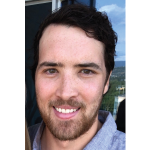
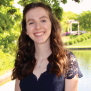
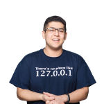
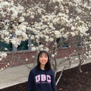
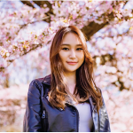

# Title
----
Some text

## Open Physics Problem Bank Project Team Members
****

| Name | GitHub handle | Preferred Email address |
| ---- | ------------- | ----------------------- |
| Firas Moosvi | firasm | firas.moosvi@ubc.ca |
| Stephen Collins | SteveCollins17 |  stephen.collins@ubc.ca |
| Michael Kudla | michaelwkudla | michaelkudla@alumni.ubc.ca |
| Graham Bovett | gbovett | |
| Abby Kiehlbauch | abbykiehlbauch | |
| Parsa Rajabi | Parsa-Rajabi | |
| Paula Wong-Chung | KafkaNoNeko | paula.wong-chung@alumni.ubc.ca |
| Edris Wu | edriswu | |

## Bios
****

## Principal Investigator

  

 </img>

#### **Dr. Firas Moosvi**

Dr. Moosvi's bio.       

## Graduate students

  

 </img>

#### **Stephen Collins**

I am a PhD candidate in medical physics here at UBCO. My research is in iterative image reconstruction methods for optical CT radiochromic gel dosimetry. Outside of my research I enjoy hockey, golf and snowboarding.      

 </img>

#### **Michael Kudla**

I am a PhD student in MedPhys. I am developing a patient specific technology suite for low cost imaging and surgical tool manufacturing (3D printed) for treatment of gynecological malignancies. I am into rock climbing and ski-touring.      

## Undergraduate students

  

 </img>

#### **Graham Bovett**

Some text      

 </img>

#### **Abby Kiehlbauch**

I am a first year Bachelor of Arts student at UBCO planning to major in Computer Science. As it is my first year I don't have a specific area of interest, however my passions have always been mental health advocacy and social justice - I hope to find a way in which Computer Science can elevate those two fields. I am looking forward to further exploring the field of Computer Science in my next three years at UBCO. While I'm not studying or spending my days on Zoom I am usually reading, sewing, crocheting, or baking!      

 </img> 

#### **Parsa Rajabi**

I am a 5th year Computer Science student with a background in Project Management, DevOps, Software Development, and research. I have a strong passion for Computer Science Education, Computational Thinking within K-12 Education and Human-Computer Interaction (HCI). Aside from doing research and teaching, I spend my spare time cooking, traveling, hiking and volunteering in the community / on campus!     

 </img>

#### **Paula Wong-Chung**

I am a second-year Computer Science major at UBCO.  While I currently do not have any particular area of interest, my focus is on the intersection of Mathematics and Computer Science.  I enjoy trying out new things and challenging myself.   I spend my spare time listening to music, drawing, and looking for new stories to immerse myself in.      

 </img>

#### **Edris Wu**

I am a third year UBC student majoring in Cognitive Systems. My interests are mainly in computer science and psychology. I am interested in understanding the brain's role in cognitive processes and perception, I also enjoy coding and learning about artificial intelligence as well as human computer interaction. In my spare time I enjoy going on walks with my dog, trying new foods, and listening to podcasts.     
