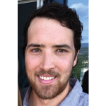
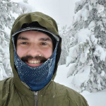
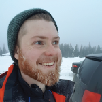
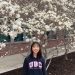

# Title

Some text

## Open Physics Problem Bank Project Team Members
****

| Name | GitHub handle | Preferred Email address |
| ---- | ------------- | ----------------------- |
| Firas Moosvi | firasm | firas.moosvi@ubc.ca |
| Stephen Collins | SteveCollins17 |  stephen.collins@ubc.ca |
| Michael Kudla | michaelwkudla | michaelwkudla@gmail.com  |
| Graham Bovett | gbovett | gbovett@gmail.com |
| Abby Kiehlbauch | abbykiehlbauch | abbykiehlbauch@gmail.com|
| Maya Patel | maya-patel | mayapatel9@gmail.com |
| Parsa Rajabi | Parsa-Rajabi |ParsaRajabiPR@gmail.com |
| Paula Wong-Chung | KafkaNoNeko | paula.wong-chung@alumni.ubc.ca |
| Edris Wu | edriswu | edriswu@gmail.com |

## Bios
****

### Principal Investigator

  

 </img>

#### **Dr. Firas Moosvi**

Firas Moosvi is a Lecturer at UBC Okanagan in the Computer Science, Math, Physics, and Statistics department. He teaches courses in Physics, Data Science, and Computer Science at the undergraduate and graduate levels. He has many research interests and they fall under three main umbrellas: medical imaging for applications in cancer, scholarship of teaching and learning (SoTL), and learning analytics. Most recently, he is looking at how the field of learning analytics can provide insight to surface and reduce inequities in STEM programs. Firas has a deep appreciation for data visualization, active learning, and open source projects.       

### Graduate students

  

 </img>

#### **Stephen Collins**

I am a PhD candidate in medical physics here at UBCO. My research is in iterative image reconstruction methods for optical CT radiochromic gel dosimetry. Outside of my research I enjoy hockey, golf and snowboarding.       

 </img>

#### **Michael Kudla**

I am a PhD student in MedPhys. I am developing a patient specific technology suite for low cost imaging and surgical tool manufacturing (3D printed) for treatment of gynecological malignancies. I am into rock climbing and ski-touring.      

### Undergraduate students

  

 </img>

#### **Graham Bovett**

I am a 3rd year Comp Sci student at UBCO. I am looking forward to specializing in AI and machine learning in my future courses and through co-op placements. Outside of school, I enjoy hiking, camping, snowboarding, and sailing.        

 </img>

#### **Abby Kiehlbauch**

I am a first year Bachelor of Arts student at UBCO planning to major in Computer Science. As it is my first year I don't have a specific area of interest, however my passions have always been mental health advocacy and social justice - I hope to find a way in which Computer Science can elevate those two fields. I am looking forward to further exploring the field of Computer Science in my next three years at UBCO. While I'm not studying or spending my days on Zoom I am usually reading, sewing, crocheting, or baking!      

 </img> 

#### **Maya Patel**

I am a third year physics student at UBCO. I am passionate about physics education and hoping to pursue a masters after I graduate. I have always loved teaching and I was excited about this opportunity to make physics education more accessible. When I am not studying, you can find me hiking, skiing or rock climbing.      

 </img> 

#### **Parsa Rajabi**

I am a 5th year Computer Science student with a background in Project Management, DevOps, Software Development, and research. I have a strong passion for Computer Science Education, Computational Thinking within K-12 Education and Human-Computer Interaction (HCI). Aside from doing research and teaching, I spend my spare time cooking, traveling, hiking and volunteering in the community / on campus!

[ LinkedIn](https://www.linkedin.com/in/parsa-rajabi/)      

 </img>

#### **Paula Wong-Chung**

I am a second-year Computer Science major at UBCO.  While I currently do not have any particular area of interest, my focus is on the intersection of Mathematics and Computer Science.  I enjoy trying out new things and challenging myself.   I spend my spare time listening to music, drawing, and looking for new stories to immerse myself in.       

 </img>

#### **Edris Wu**

I am a third year UBC student majoring in Cognitive Systems. My interests are mainly in computer science and psychology. I am interested in understanding the brain's role in cognitive processes and perception, I also enjoy coding and learning about artificial intelligence as well as human computer interaction. In my spare time I enjoy going on walks with my dog, trying new foods, and listening to podcasts.

     

