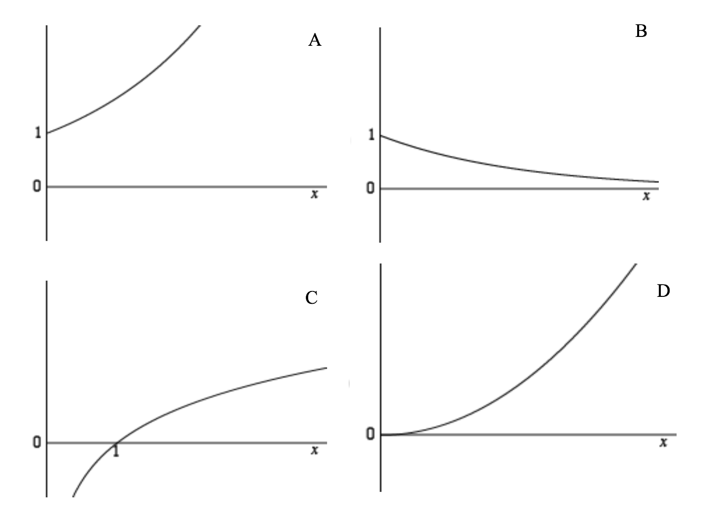

# {{ params_vars_title }}
Which is a sketch of the function $ y = e^{x} $ for $ x \geq 0 $

## Part 1

### Answer Section

- {{ params_part1_ans1_value}}
- {{ params_part1_ans2_value}}
- {{ params_part1_ans3_value}}
- {{ params_part1_ans4_value}}
- {{ params_part1_ans5_value}}

## Attribution

Problem is licensed under the [CC-BY-NC-SA 4.0 license](https://creativecommons.org/licenses/by-nc-sa/4.0/).  