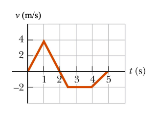

# {{ params_vars_title }}
The figure shows the velocity-versus-time graph for a particle moving along the x-axis. Its position at $t$ = 0 s is {{params.x_i}} $m$.

## Part 1

What is the particles velocity at $t$ = {{params_t}} $s$? If the answer is undefined, enter 100.

### Answer Section

Please enter in a numeric value in {{ params_vars_units1 }}.

## Part 2

What is the particles position at $t$ = {{params_t}} $s$? If the answer is undefined, enter 100.

### Answer Section

Please enter in a numeric value in {{ params_vars_units2 }}.

## Part 3

What is the particles acceleration at $t$ = {{params_t}} $s$? If the answer is undefined, enter 100.

### Answer Section

Please enter in a numeric value in {{ params_vars_units3 }}.

## Attribution

Problem is licensed under the [CC-BY-NC-SA 4.0 license](https://creativecommons.org/licenses/by-nc-sa/4.0/).  