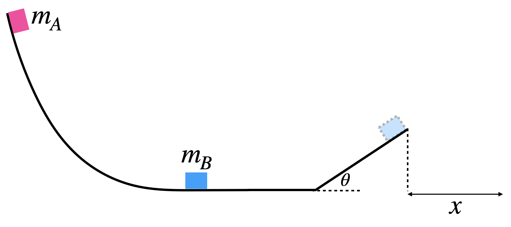

# {{ params.vars.title }}
A frictionless ski jump is designed such that at the bottom of the hill, there is a short flat section.

After the flat section, the slope continues into a ramp of vertical height {{ params.ramp_h }} m, at an angle {{ params.ramp_angle }} degrees (relative to the horizontal).

The top of the ski jump is {{ params.jump_h }} {{ params.vars.units2 }} high off the ground.

Block A of mass {{ params.mA }}kg is released from the top of the slope so that it slides down and makes a perfectly elastic collision with Block B of mass {{ params.mB }}kg.
This causes the Block B to slide up the frictionless ramp and undergo projectile motion, before landing a horizontal distance $x$ {{ params.vars.units2 }} away from the ramp.

## Part 1

What is the speed of Block B (in {{ params.vars.units1 }}), immediately after the perfectly elastic collision?

### Answer Section

Please enter in a numeric value in m/s.

## Part 2

What is the horizontal distance (in {{ params.vars.units2 }}) that Block B travels after it goes off the ramp ($x$)?

### Answer Section

Please enter in a numeric value in m.

## Attribution

Problem is licensed under the [CC-BY-NC-SA 4.0 license](https://creativecommons.org/licenses/by-nc-sa/4.0/).  