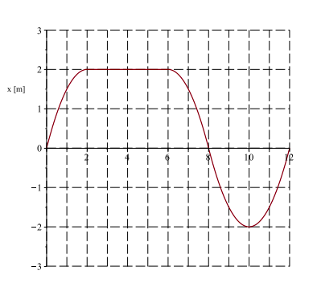

# {{ params.vars.title }}
Consider the following motion diagram for a dog running down a straight path.

## Attribution

Problem is licensed under the [CC-BY-NC-SA 4.0 license](https://creativecommons.org/licenses/by-nc-sa/4.0/).  