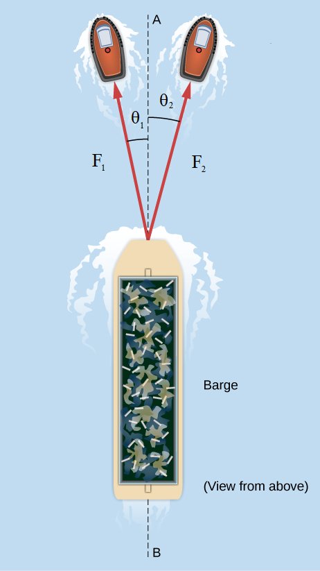

# {{ params.vars.title }}
A barge is pulled by the two tugboats shown in the following figure.
One tugboat pulls on the barge with a force of magnitude $F_2 = $ {{ params.F2 }} units of force at $\theta_2 = $ {{ params.theta_2 }}$^{\circ}$ above the line AB and the other tugboat pulls on the barge with a force of magnitude $F_1 = $ {{ params.F1 }} units of force at $\theta_1 = $ {{ params.theta_1 }}$^{\circ}$ below the line AB.

Assume $+y$ is straight ahead, and $+x$ is to the right.

<h5>Figure of a barge pulled by two tugboats.</h5>
A straight line AB is drawn through the center of the barge. One tugboat pulls the barge to the left with a force of magnitude F one at an angle theta one relative to AB. The other tugboat pulls to the right with a force F two at angle theta two relative to AB.

## Part 1

Resolve the pulling forces to theircomponents.
What is the $x$-component of the force above the line AB i.e. the right force?
Remember to consider the sign convention.

### Answer Section

Please enter in a numeric value in 'units of force'.

## Part 2

Resolve the pulling forces to theircomponents.
What is the $y$-component of the force above the line AB i.e. the right force?
Remember to consider the sign convention.

### Answer Section

Please enter in a numeric value in 'units of force'.

## Part 3

Resolve the pulling forces to theircomponents.
What is the $x$-component of the force below the line AB i.e. the left force?
Remember to consider the sign convention.

### Answer Section

Please enter in a numeric value in 'units of force'.

## Part 4

Resolve the pulling forces to theircomponents.
What is the $y$-component of the force below the line AB i.e. the left force?
Remember to consider the sign convention.

### Answer Section

Please enter in a numeric value in 'units of force'.

## Part 5

What is the magnitude of the resultant pull?

### Answer Section

Please enter in a numeric value in 'units of force'.

## Part 6

What is the direction of the resultant vector relative to the line AB?

### Answer Section

- {{ params.part6.ans1.value }}
- {{ params.part6.ans2.value }}
- {{ params.part6.ans3.value }}
- {{ params.part6.ans4.value }}
- {{ params.part6.ans5.value }}
- {{ params.part6.ans6.value }}

## Attribution

Problem is from the [OpenStax University Physics Volume 1](https://openstax.org/details/books/university-physics-volume-1) textbook, licensed under the [CC-BY 4.0 license](https://creativecommons.org/licenses/by/4.0/). 