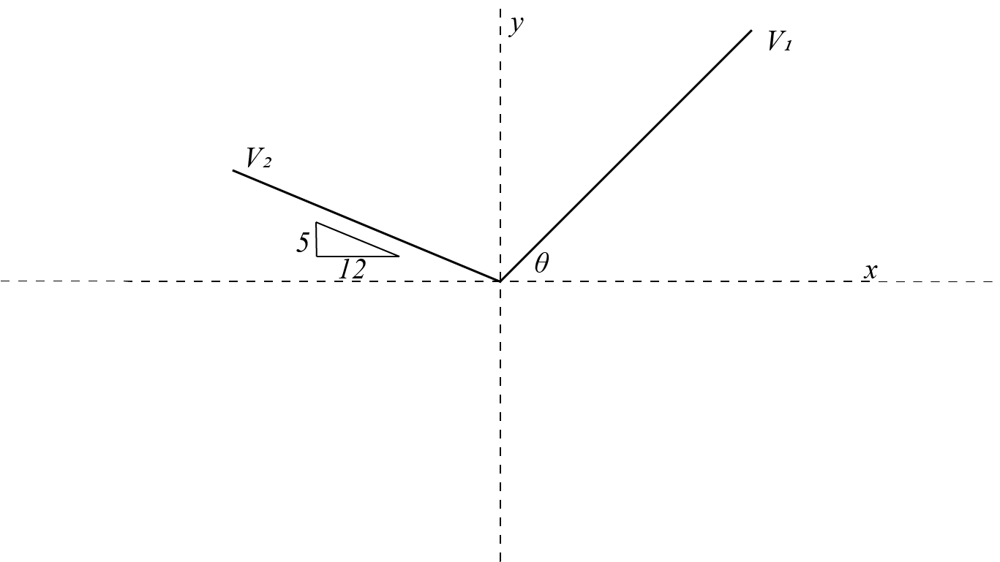

# {{ params.vars.title }}

For the diagram above $\vec{V_1} = {{ params.v1 }}$, $\vec{V_2} = {{ params.v2 }}$, and $\theta = {{ params.angle }}$ what is:

## Part 1

### Answer Section

Please enter in a numeric value.

## Part 2

### Answer Section

Please enter in a numeric value.

## Part 3

### Answer Section

Please enter in a numeric value.

## Part 4

### Answer Section

Please enter in a numeric value.

## Part 5

### Answer Section

Please enter in a numeric value.

## Part 6

### Answer Section

Please enter in a numeric value.

## Attribution

Problem is licensed under the [CC-BY-NC-SA 4.0 license](https://creativecommons.org/licenses/by-nc-sa/4.0/).  