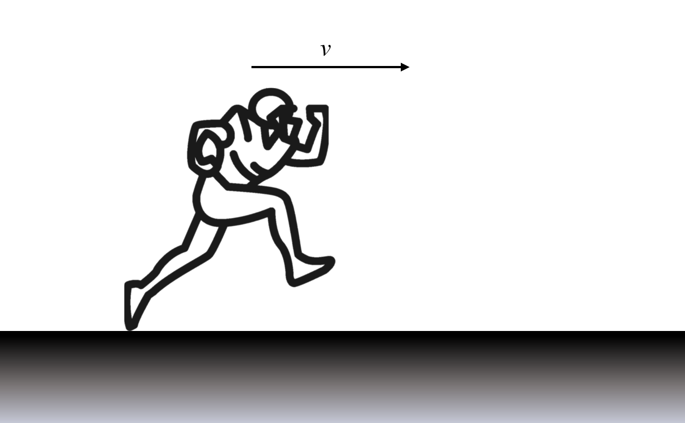

# {{ params.vars.title }}

A football player participates in a ${{params.dT}} \ \rm{m}$ sprint. They starts accelerating uniformly from rest in a straight line, where they reach a top speed of ${{params.vM}} \ \rm{m/s}$ at the ${{params.d1}} \ \rm{m}$ mark. He then maintains this speed for the next ${{params.d2}} \ \rm{m}$. After that he slows down uniformly to a final speed of ${{params.vF}} \ \rm{m/s}$ at the finish line.

## Part 1

What is the acceleration just before the ${{params.d1}} \ \rm{m}$ mark?

### Answer Section

Please enter in a numeric value in $\rm{m/s^2}$.

## Part 2

What is the acceleration just before the finish line?

### Answer Section

Please enter in a numeric value in $\rm{m/s^2}$.

## Attribution

Problem is licensed under the [CC-BY-NC-SA 4.0 license](https://creativecommons.org/licenses/by-nc-sa/4.0/).  