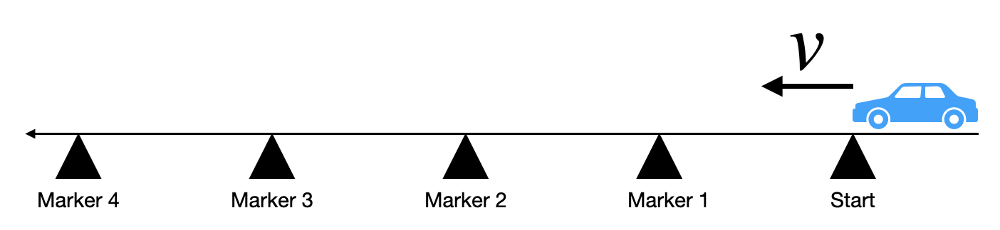

# {{ params.vars.title }}
A {{ params.vars.vehicle }} accelerates uniformly from rest along a straight track towards the left.
The track has five markers: Start, and Markers 1-4.
Each marker is equally spaced so Marker 2 is halfway between Start and Marker 4.
The {{ params.vars.vehicle }} reaches a speed of {{ params.vars.v1 }} m/s as it passes the last marker, Marker 4.

## Part 1

Which marker is the car closest to when the race car is traveling at {{ params.vars.v2 }} m/?

### Answer Section

- {{ params.part1.ans1.value }}
- {{ params.part1.ans2.value }}
- {{ params.part1.ans3.value }}
- {{ params.part1.ans4.value }}
- {{ params.part1.ans5.value }}
- {{ params.part1.ans6.value }}
- {{ params.part1.ans7.value }}
- {{ params.part1.ans8.value }}

## Attribution

Problem is licensed under the [CC-BY-NC-SA 4.0 license](https://creativecommons.org/licenses/by-nc-sa/4.0/).  