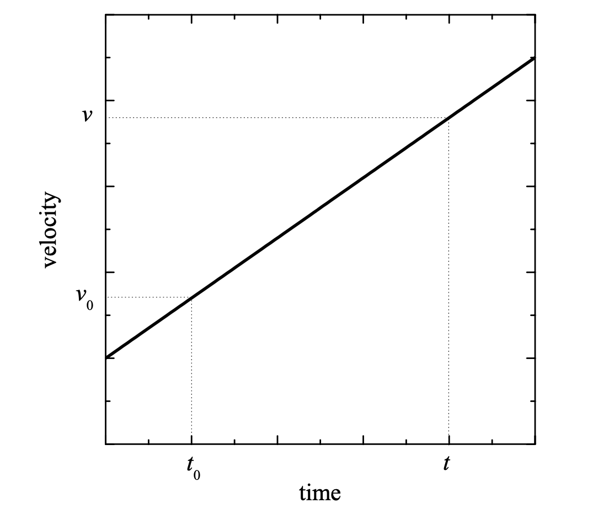

# {{ params_vars_title }}
The figure below shows a plot of velocity versus time for a particle moving with constant acceleration $a_c$. The particle has velocity $v_0$ at time $t_0$. In the time elapsed between $t_0$ and a later time $t$ ($t > t_0$), the particle is displaced $\Delta x$.

## Part 1

Use this plot to derive an expression for $\Delta x$ in terms $a_c$, $v_0$, $t_0$, and $t$.

Note that it may not be necessary to use every variable. Use the following table as a reference for using each variable:

| $Variable$ | Use      |
|------------|----------|
| $a_c$      |  a_c     |
| $v_0$      |  v_0     |
| $t_0$      |  t_0     |
| $t$        |  t       |

### Answer Section

{{ substitutions.part1.label }}

## Attribution

Problem is licensed under the [CC-BY-NC-SA 4.0 license](https://creativecommons.org/licenses/by-nc-sa/4.0/).  