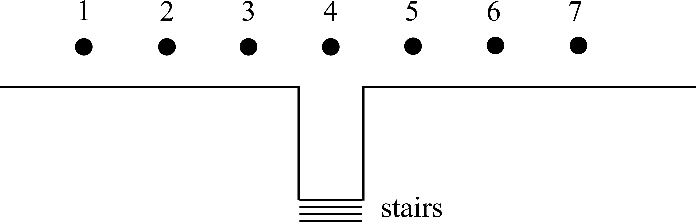

# {{ params.vars.title }}
{{ params.vars.name }} delivers newspapers by throwing them out of the passenger window of their car, perpendicular to the motion of their car.

A motion diagram for their car is shown in the figure below.

<h5>Long Description of image: Motion diagram of the car.</h5>
The figure shows seven equally spaced dots numbered one to seven from left to right. The fourth dot is directly above the stairs.

Long description ends.

The distance to the stairs of their next delivery is drawn to scale.

## Part 1

Assuming that air resistance can be ignored, that {{ params.vars.name }} throws the paper relative to the car at the speed of the car, and that the paper remains in the air until it hits the stairs, at what time label from the figure does {{ params.vars.name }} throw the paper?

### Answer Section

- {{ params.part1.ans1.value }}
- {{ params.part1.ans2.value }}
- {{ params.part1.ans3.value }}
- {{ params.part1.ans4.value }}
- {{ params.part1.ans5.value }}
- {{ params.part1.ans6.value }}

## Attribution

Problem is licensed under the [CC-BY-NC-SA 4.0 license](https://creativecommons.org/licenses/by-nc-sa/4.0/).  