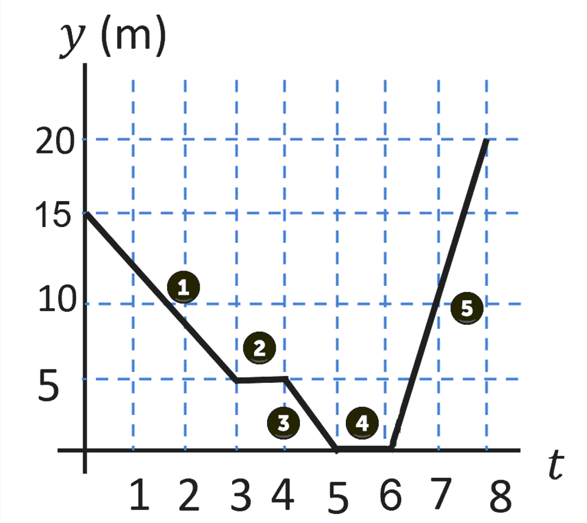

# {{ params.vars.title }}
A position versus time graph of the motion of an object is given below.

## Part 1

Write a short description of the motion of the object.

### Answer Section

Answer in 5-7 sentences, and try to use full sentences.

## Part 2

Calculate the speed of the object in the first segment of the motion.

### Answer Section

Please enter in a numeric value in {{ params.vars.units }}.

## Part 3

Calculate the speed of the object in the second segment of the motion.

### Answer Section

Please enter in a numeric value in {{ params.vars.units }}.

## Part 4

Calculate the speed of the object in the third segment of the motion.

### Answer Section

Please enter in a numeric value in {{ params.vars.units }}.

## Part 5

Calculate the speed of the object in the fourth segment of the motion.

### Answer Section

Please enter in a numeric value in {{ params.vars.units }}.

## Part 6

Calculate the speed of the object in the fifth segment of the motion.

### Answer Section

Please enter in a numeric value in {{ params.vars.units }}.

## Attribution

Problem is licensed under the [CC-BY-NC-SA 4.0 license](https://creativecommons.org/licenses/by-nc-sa/4.0/).  