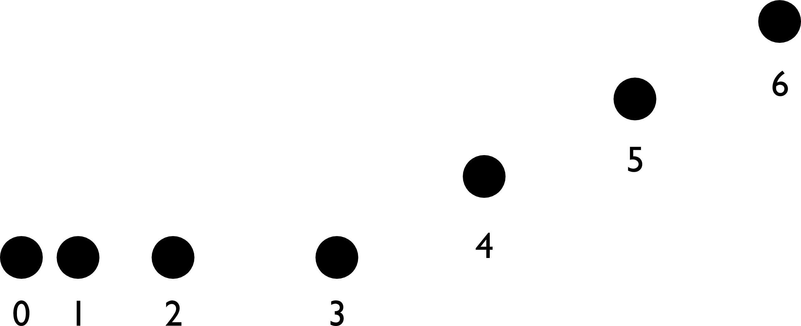

# {{ params_vars_title }}
A set of dots representing the position of a living creature is shown in the figure. The spots are equally spaced in time.

<h5>Long Description of image: Motion diagram of the creature.</h5>
The motion diagram consists of seven dots numbered 0 to 6.
Dots 0 to 3 form a horizontal line with an increasing spacing between adjacent dots.
Dots 3 to 6 form a straight line with positive slope with an equal spacing between adjacent dots.

Long description ends.

## Part 1

From dots 0 to 3, is the creature slowing down, speeding up, stationary or maintaining a constant speed? Please explain your answer.

### Answer Section

- {{ params_part1_ans1_value }}
- {{ params_part1_ans2_value }}
- {{ params_part1_ans3_value }}
- {{ params_part1_ans4_value }}

## Part 2

From dots 3 to 6, is the creature slowing down, speeding up, stationary or maintaining a constant speed?  Please explain your answer.

### Answer Section

- {{ params_part2_ans1_value}}
- {{ params_part2_ans2_value}}
- {{ params_part2_ans3_value}}
- {{ params_part2_ans4_value}}

## Part 3

Describe a physical situation this set of dots could represent.  (Choose a creature and explain what it is doing from time 0 to time 6).

### Answer Section

- {{ params_part3_ans1_value}}
- {{ params_part3_ans2_value}}
- {{ params_part3_ans3_value}}
- {{ params_part3_ans4_value}}

## Attribution

Problem is licensed under the [CC-BY-NC-SA 4.0 license](https://creativecommons.org/licenses/by-nc-sa/4.0/).  