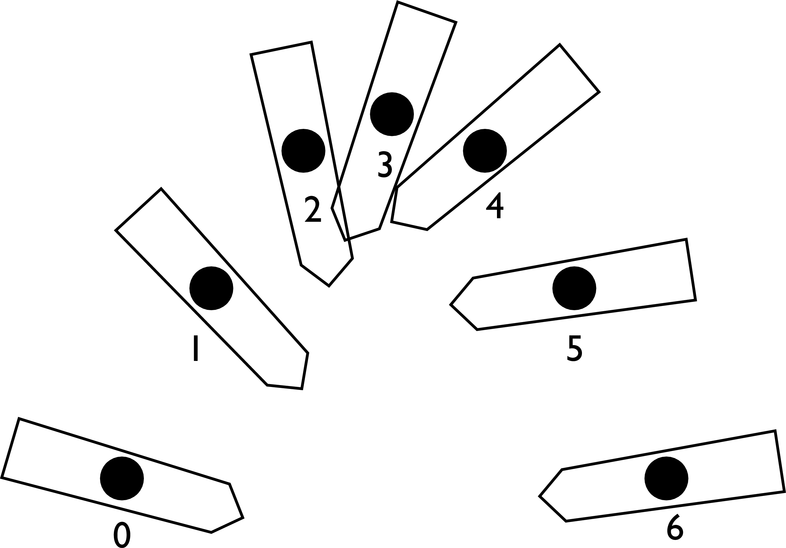

# {{ params_vars_title }}

<h5>Long Description of image: Motion diagram of a rotating pencil as it flies through the air.</h5>
The centre of mass of the pencil is marked by a dot throughout its motion through the air. The motion of the pencil has a shape similar to that of a parabola.
The motion diagram consists of seven dots numbered 0 to 6 and the dot numbered 3 is at the peak of the parabola.

Long description ends.

## Part 1

Explain why the particle model that we use to draw motion diagrams cannot adequately represent the rotation of a pencil as it flies through the air as seen in the figure.

### Answer Section

- {{ params_part1_ans1_value }}
- {{ params_part1_ans2_value }}
- {{ params_part1_ans3_value }}
- {{ params_part1_ans4_value }}

## Attribution

Problem is licensed under the [CC-BY-NC-SA 4.0 license](https://creativecommons.org/licenses/by-nc-sa/4.0/).  