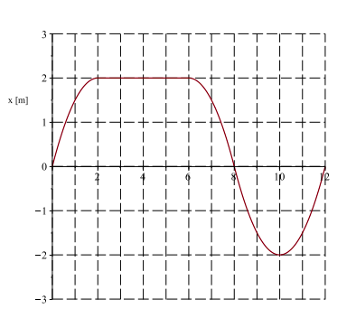

# {{ params_vars_title }}
Consider the following motion diagram for a dog running down a straight path.
In the motion diagram, the x-axis is the time in seconds, and the y-axis is position in metres.

## Question Text

Which of the following statements are True?

### Answer Section

Select all the choices that apply.

Note: You will be awarded full marks only if you select all the correct choices, and none of the incorrect choices. Choosing incorrect choices as well as not choosing correct choices will result in deductions.

- {{ params_part1_ans1_value}}
- {{ params_part1_ans2_value}}
- {{ params_part1_ans3_value}}
- {{ params_part1_ans4_value}}

## Attribution

Problem is licensed under the [CC-BY-NC-SA 4.0 license](https://creativecommons.org/licenses/by-nc-sa/4.0/).  