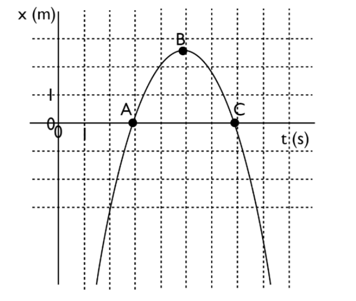

# {{ params_vars_title }}
At each of A, B and C on the graph below, estimate the $x$-component of the velocity vector, $v_x$ from the position vs. time graph.

## Part 1

Draw a tangent line to the graph at each point (A,B,C).

Please save the above image to use for sketching on the graph. Make sure to keep your tangent lines clear.

Upload your final graph as a pdf file titled "graph.pdf".

### Answer Section

File upload box will be shown here.

## Part 2

Please enter your estimation of the $x$-component of the velocity vector $v_x$ at A.

### Answer Section

Please enter in a numeric value.

## Part 3

Please enter your estimation of the $x$-component of the velocity vector $v_x$ at B.

### Answer Section

Please enter in a numeric value.

## Part 4

Please enter your estimation of the $x$-component of the velocity vector $v_x$ at C.

### Answer Section

Please enter in a numeric value.

## Part 5

What sign, if any, does the x-component of the acceleration vector, $a_x$ , have at point B?

### Answer Section

- {{ params.part1.ans1.value }}
- {{ params.part1.ans2.value }}
- {{ params.part1.ans3.value }}

## Attribution

Problem is licensed under the [CC-BY-NC-SA 4.0 license](https://creativecommons.org/licenses/by-nc-sa/4.0/).  