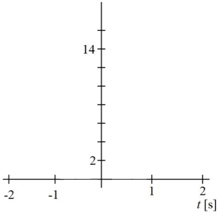

# {{ params_vars_title }}
The position of a vole as it runs toward a garden is given by the expression $x(t) = t^3 - t + 10$, where $x(t)$ is position expressed as a function of time $t$. The units of $x(t)$ are $\rm{cm}$ and the units of $t$ are $\rm{s}$.

## Part 1

Determine $x(t)$ when $t = -2 \rm{s}$.

### Answer Section

Please enter in a numeric value in $\rm{cm}$.

## Part 2

Determine $x(t)$ when $t = -1 \rm{s}$.

### Answer Section

Please enter in a numeric value in $\rm{cm}$.

## Part 3

Determine $x(t)$ when $t = 0 \rm{s}$.

### Answer Section

Please enter in a numeric value in $\rm{cm}$.

## Part 4

Determine $x(t)$ when $t = 1 \rm{s}$.

### Answer Section

Please enter in a numeric value in $\rm{cm}$.

## Part 5

Determine $x(t)$ when $t = 2 \rm{s}$.

### Answer Section

Please enter in a numeric value in $\rm{cm}$.

## Part 6

On the coordinate system below, plot each of the points from parts 1-5 and connect them with a smooth line.

Do this by downloading the image (right-click $\to$ save image as) and drawing on it. Upload your graph as a pdf titled "part6.pdf".

### Answer Section

File upload box will be shown here.

## Part 7

Find an expression for the velocity of the vole as a function of time.

Note that it may not be necessary to use every variable. Use the following table as a reference for each variable:

| For | Use |
|-----|-----|
| $t$ | t   |

### Answer Section

## Part 8

What is the first time that the vole is at rest? (Enter the lowest value of $t$ even if it is less than $0$)

### Answer Section

Please enter in a numeric value in $\rm{s}$.

## Part 9

What time is the next time that the vole is at rest? (Enter the other value of $t$)

### Answer Section

Please enter in a numeric value in $\rm{s}$.

## Part 10

What does it mean for $t$ to be less than $0$?

### Answer Section

Answer in 1-2 sentences and try to use full sentences.

## Part 11

Select the interval(s) over which the velocity of the vole is positive.

Note: You will be awarded full marks only if you select all the correct choices, and none of the incorrect choices. Choosing incorrect choices as well as not choosing correct choices will result in deductions.

### Answer Section

- {{ params_part11_ans1_value}}
- {{ params_part11_ans2_value}}
- {{ params_part11_ans3_value}}
- {{ params.part11.ans4.value}}

## Part 12

Select the interval(s) over which the velocity of the vole is negative.

Note: You will be awarded full marks only if you select all the correct choices, and none of the incorrect choices. Choosing incorrect choices as well as not choosing correct choices will result in deductions.

### Answer Section

- {{ params_part12_ans1_value}}
- {{ params_part12_ans2_value}}
- {{ params_part12_ans3_value}}
- {{ params.part12.ans4.value}}

## Part 13

Find an expression for the acceleration of the vole as a function of time.

Note that it may not be necessary to use every variable. Use the following table as a reference for each variable:

| For | Use |
|-----|-----|
| $t$ | t   |

### Answer Section

## Part 14

At what time is the acceleration of the vole zero?

### Answer Section

Please enter in a numeric value in $\rm{s}$.

## Part 15

Select the intervals over which the speed of the vole is increasing.

Note: You will be awarded full marks only if you select all the correct choices, and none of the incorrect choices. Choosing incorrect choices as well as not choosing correct choices will result in deductions.

### Answer Section

- {{ params_part15_ans1_value}}
- {{ params_part15_ans2_value}}
- {{ params_part15_ans3_value}}
- {{ params_part15_ans4_value}}

## Part 16

Select the intervals over which the speed of the vole is decreasing.

Note: You will be awarded full marks only if you select all the correct choices, and none of the incorrect choices. Choosing incorrect choices as well as not choosing correct choices will result in deductions.

### Answer Section

- {{ params_part16_ans1_value}}
- {{ params_part16_ans2_value}}
- {{ params_part16_ans3_value}}
- {{ params_part16_ans4_value}}

## Attribution

Problem is licensed under the [CC-BY-NC-SA 4.0 license](https://creativecommons.org/licenses/by-nc-sa/4.0/).  