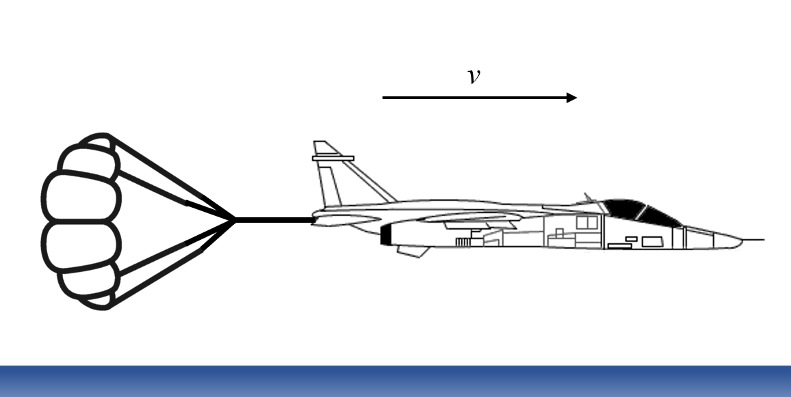

# {{ params_vars_title }}

The speed of a jet fighter is ${{params_v0}} \ \rm{m/s}$ when its drag parachute deploys.
At ${{params_v}} \ \rm{m/s}$, the parachute is jettisoned (discarded).
If the acceleration in $\rm{m/s^2}$ (note negative sign) during the time that the parachute is deployed is ${{params_ac}} v^2$ (speed $v$ in $\rm{m/s}$), calculate the time spent in this braking phase. Neglect other forms of braking or resistance.

## Part 1

What is $t$?

### Answer Section

Please enter in a numeric value in $\rm{s}$.

## Attribution

Problem is licensed under the [CC-BY-NC-SA 4.0 license](https://creativecommons.org/licenses/by-nc-sa/4.0/).  