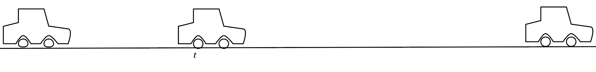

# {{ params.vars.title }}

A car reaches its maximum speed in {{params.max_speed_t}} $seconds$ from rest with constant acceleration.
It then maintains that speed and travels {{params.yards}} miles with an overall time of {{params.overall_t}} $hours$.

## Question Text

Determine the maximum speed $v\_{max}$ of the car.

### Answer Section

Please enter in a numeric value in {{ params.vars.units }}.

## Attribution

Problem is licensed under the [CC-BY-NC-SA 4.0 license](https://creativecommons.org/licenses/by-nc-sa/4.0/).  