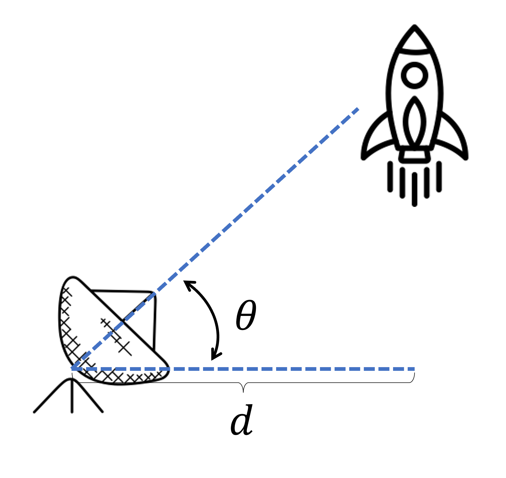

# {{ params_vars_title }}
A rocket is fired vertically from a launch pad $d={{params_d}} \ \rm{km}$ away from a tracking radar.
At some time, the angle of elevation is $\theta={{params_theta1}}^\circ$.
After ${{params_dt}} \ \rm{s}$, the angle becomes $\theta={{params_theta2}}^\circ$.

## Part 1

What is the approximate speed of the rocket?

### Answer Section

Please enter in a numeric value in $m/s$.

## Attribution

Problem is licensed under the [CC-BY-NC-SA 4.0 license](https://creativecommons.org/licenses/by-nc-sa/4.0/).  