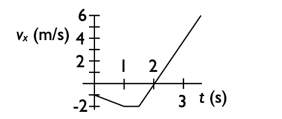

# {{ params_vars_title }}
For this problem, refer to the following figure.

Top: The x-component of a velocity vs. time graph is shown for an object:

Bottom: Below are *possible* options of that same object's "acceleration vs. time" graph:

## Part 1

Of the listed acceleration vs. time graphs shown in the bottom figure, which is consistent with the velocity vs. time graph shown in the top figure?

### Answer Section

- {{ params_part1_ans1_value}}
- {{ params_part1_ans2_value}}
- {{ params_part1_ans3_value}}
- {{ params_part1_ans4_value}}
- {{ params_part1_ans5_value}}

## Part 2

If the initial position of the object whose velocity vs. time graph is shown in the figure (Top) is $x_0$ = 0 $m$, at what time does the object return to the position $x$ = 0 $m$ ?

### Answer Section

- {{ params_part2_ans1_value}}
- {{ params_part2_ans2_value}}
- {{ params_part2_ans3_value}}
- {{ params_part2_ans4_value}}
- {{ params_part2_ans5_value}}

## Attribution

Problem is licensed under the [CC-BY-NC-SA 4.0 license](https://creativecommons.org/licenses/by-nc-sa/4.0/).  