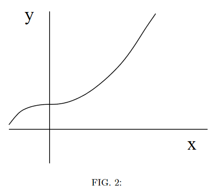

# {{ params.vars.title }}

## Part 1

A particle's path follows the trajectory shown in the figure. Which of the following statements is correct?

<h5>Long Description of image: Figure of the particle's trajectory.</h5>
A cartesian plane is used. The particle starts at a point with a negative x-coordinate and a positive y-coordinate. The graph increases uniformly and then starts to increase at a slower rate until it crosses the y-axis in a horizontal line. From there, it starts to increase at an increasing rate until a uniform increase (a straight line) is reached.

Long description ends.

### Answer Section

- {{ params.part1.ans1.value }}
- {{ params.part1.ans2.value }}
- {{ params.part1.ans3.value }}
- {{ params.part1.ans4.value }}
- {{ params.part1.ans5.value }}

## Attribution

Problem is licensed under the [CC-BY-NC-SA 4.0 license](https://creativecommons.org/licenses/by-nc-sa/4.0/).  