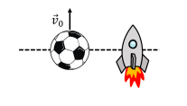

# {{ params.vars.title }}

## Question Text

At time $t$ = 0 $s$, a large soccer ball is kicked straight up into the air with an initial velocity $\vec{v_0}$. Also at $t$ = 0 $s$, a small rocket fires its engines such that it is launched straight up into the air with a constant acceleration $\vec{a}$. The rocket starts from rest. As shown in the figure, at $t$ = 0 $s$ the centres of the soccer ball and rocket have the same position.

At what time (other than $t$ = 0), do the centres of the soccer ball and rocket once again
have the same position? Give your answer in terms of $v_0$, $a$, and $g$. Ignore air resistance.

Note that it may not be necessary to use every variable. Use the following table as a reference for each variable:

| For  | Use   |
|----------|-------|
| $v_0$| v_0|
| $a$  | a  |
| $g$  | g  |

### Answer Section

## Attribution

Problem is licensed under the [CC-BY-NC-SA 4.0 license](https://creativecommons.org/licenses/by-nc-sa/4.0/).  