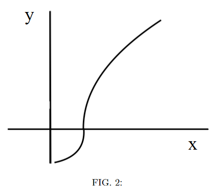

# {{ params_vars_title }}

## Part 1

A particle follows the trajectory shown in the figure without stopping along it's path. What can you conclude aboout the particle's motion?

### Answer Section

- {{ params_part1_ans1_value }}
- {{ params_part1_ans2_value }}
- {{ params_part1_ans3_value }}
- {{ params_part1_ans4_value }}
- {{ params_part1_ans5_value }}

## Attribution

Problem is licensed under the [CC-BY-NC-SA 4.0 license](https://creativecommons.org/licenses/by-nc-sa/4.0/).  