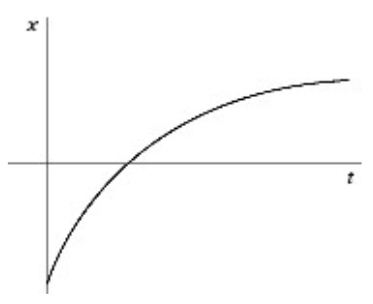
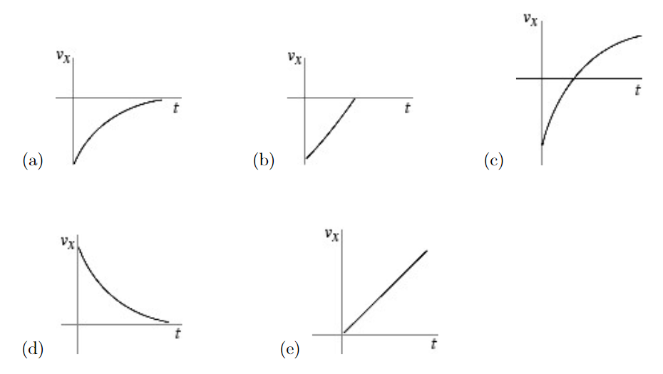

# {{ params.vars.title }}
The figure shows the graph of the position $x$ as a function of time for an object moving in a straight line (along the $x$-axis).

## Part 1

Which of the following graphs best describes the velocity along the $x$-axis as a function of time for this object?

<h5>Long Description of image: Figure of answer options.</h5>
All of the figures are velocity-time graphs. 
Figure a shows a graph which starts at a negative y-value and which increases at a decreasing rate. The graph does not cross the x-axis. 
Figure b shows a straight line which starts at a negative y-value and stops when it reaches the x-axis. 
Figure c shows a graph which starts at a negative y-value and which increases at a decreasing rate. The graph crosses the x-axis. 
Figure d shows a graph which starts at a positive y-value and which decreases at a decreasing rate. 
Figure e shows a straight line with a positive slope starting at the origin.

Long description ends.

### Answer Section

- {{ params.part1.ans1.value }}
- {{ params.part1.ans2.value }}
- {{ params.part1.ans3.value }}
- {{ params.part1.ans4.value }}
- {{ params.part1.ans5.value }}

## Attribution

Problem is licensed under the [CC-BY-NC-SA 4.0 license](https://creativecommons.org/licenses/by-nc-sa/4.0/).  