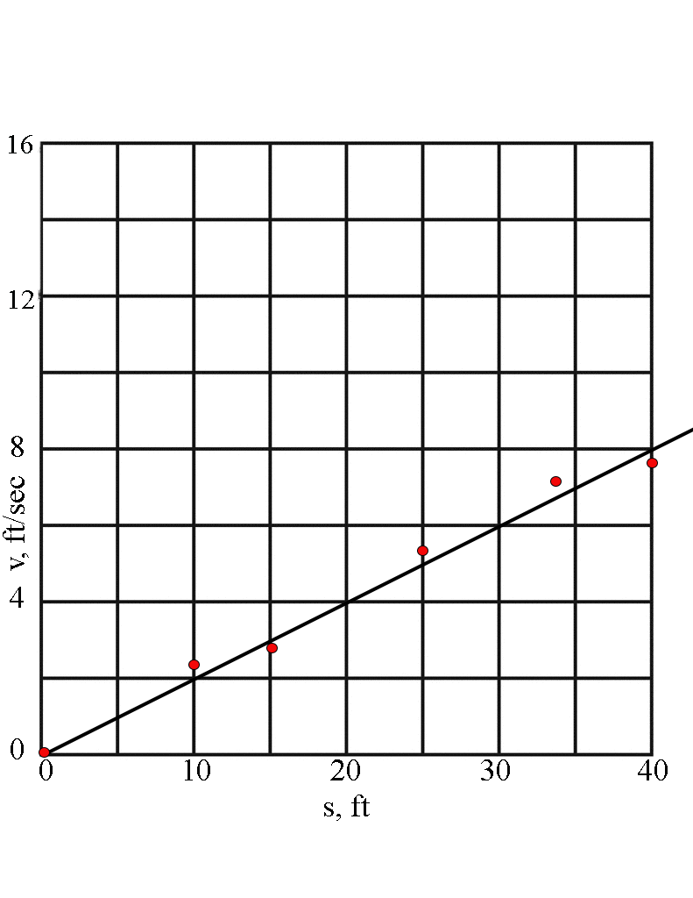

# {{ params.vars.title }}

## Question Text

The graph above shows the movement of a ball, with its displacement, $s$, measured against its velocity, $v$.
A curve is drawn through the data points as shown.
Determine the acceleration of the ball when $s = {{params.s}}$.

### Answer Section

Please enter in a numeric value in {{ params.vars.units }}.

## Attribution

Problem is licensed under the [CC-BY-NC-SA 4.0 license](https://creativecommons.org/licenses/by-nc-sa/4.0/).  