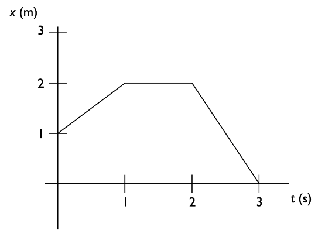

# {{ params.vars.title }}
Refer to Fig.1

## Part 1

At $t=$ {{ params.choice }}$s$, what is the x-component of the instantaneous velocity of the object whose position vs. time graph is shown in Fig.1?

### Answer Section

- {{ params.part1.ans1.value}} {{ params.vars.units}}
- {{ params.part1.ans2.value}} {{ params.vars.units}}
- {{ params.part1.ans3.value}} {{ params.vars.units}}
- {{ params.part1.ans4.value}} {{ params.vars.units}}
- {{ params.part1.ans5.value}} {{ params.vars.units}}

## Part 2

For the time interval $t=$ 0$s$ to $t=$ 3$s$ for the object whose position vs time graph is shown in Fig.1 the x-component of the average velocity ($v\_{avg,x ; 0 \rightarrow 3}$) and average speed($v\_{avg ; 0 \rightarrow 3}$) are respectively:

### Answer Section

- {{ params.part2.ans1.value}}
- {{ params.part2.ans2.value}}
- {{ params.part2.ans3.value}}
- {{ params.part2.ans4.value}}
- {{ params.part2.ans5.value}}

## Attribution

Problem is licensed under the [CC-BY-NC-SA 4.0 license](https://creativecommons.org/licenses/by-nc-sa/4.0/).  