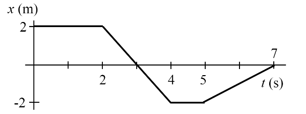
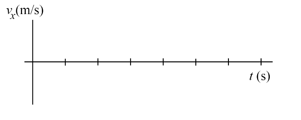

# {{ params.vars.title }}
A position vs. time graph is shown. On the velocity versus time graph below it, sketch the corresponding velocity as a function of time. Show all calculations, and label the axes appropriately.

## Question Text

Please save this image to use for sketching the graph.

Upload your final graph as a pdf file titled "velocity.pdf".

### Answer Section

File upload box will be shown here.

## Attribution

Problem is licensed under the [CC-BY-NC-SA 4.0 license](https://creativecommons.org/licenses/by-nc-sa/4.0/).  