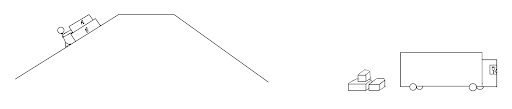

# {{ params_vars_title }}
A person is pushing crate $\rm{A}$ and $\rm{B}$ up a hill to have it slide down into an area for pickup and loading.
Crate A has a mass of $m_1 = {{ params_m1 }} \ \rm{kg}$ and Crate B has a mass of $m_2 = {{params_m2}} \ \rm{kg}$.
The hill makes an angle of $\theta =  {{ params_theta }}^{\circ}$ with the horizontal.

## Part 1

What is the acceleration on those crates as they move up the hill?

### Answer Section

Please enter in a numeric value in {{ params_vars_units }}.

## Part 2

How far will the boxes go until coming to a stop if the speed is $v_0 = {{params_m1}}\ \rm{m/s}$?

### Answer Section

Please enter in a numeric value in {{ params_vars_units }}.

## Attribution

Problem is licensed under the [CC-BY-NC-SA 4.0 license](https://creativecommons.org/licenses/by-nc-sa/4.0/).  