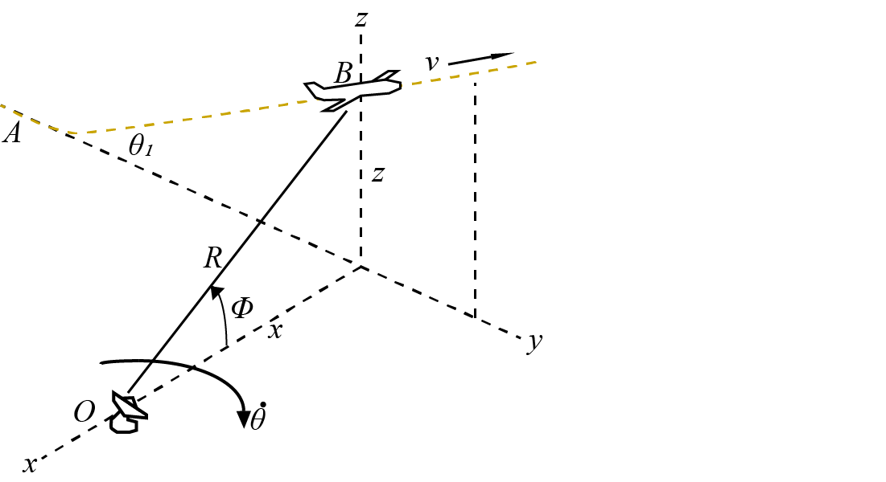

# {{ params.vars.title }}

A passenger plane takes off at $A$ and climbs at a steady angle, $\theta\_{1} = {{params.angle}}^{\circ}$ in the y-z plane at a speed of {{params.v}} $km/h$. The passenger plane is tracked by a radar dish at $O$.
Calculate the following values as the passenger plane passes point $B$, $x =$ {{params.x}} $m$ and $z =$ {{params.z}} $m$.

## Part 1

Calculate $\dot{R}$.

### Answer Section

## Part 2

Calculate $\dot{\theta}$.

### Answer Section

## Part 3

Calculate $\dot{\phi}$.

### Answer Section

## Attribution

Problem is licensed under the [CC-BY-NC-SA 4.0 license](https://creativecommons.org/licenses/by-nc-sa/4.0/).  