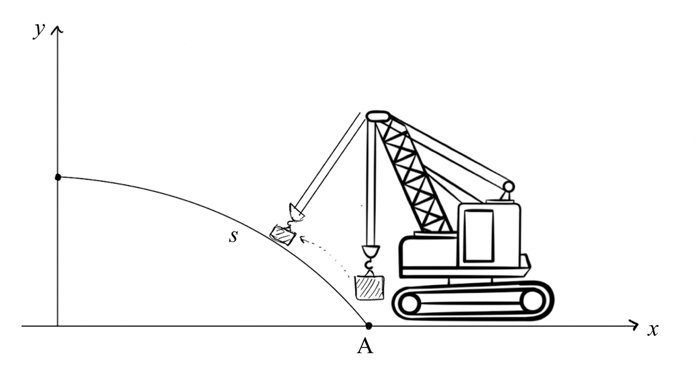

# Curvilinear Motion of a crate carried by a crane
A crane moves a crate through point A with a speed of ${{ params.v_0 }}\ \rm{ms^{-1}}$ and increases the speed constantly at a rate of ${{ params_a }}\ \rm{ms^{-2}}$. Find the magnitude of the crate's acceleration when the arc length is ${{ params_s }}\ \rm{m}$ and when $x_0 =0 \ \rm{m}$.  The equation of the arc is $y= m - \frac{x^{2}}{w}$
 
$w = {{ params_w }}\ \rm{m}$, $m = {{ params_m }}\ \rm{m}$

## Part 1

Find the speed $v_2$ when $x = 0\ \rm{m}$.

### Answer Section

Please enter the speed in $ms^{-1}$.

## Part 2

Find the radius of curvature.

### Answer Section

Please enter the radius in $m$.

## Part 3

Find $a_n$ at the same point.

### Answer Section

Please enter the acceleration in $ms^{-2}$.

## Part 4

Find the total acceleration.

### Answer Section

Please enter the acceleration in $m^s{-2}$.

## Attribution

Problem is licensed under the [CC-BY-NC-SA 4.0 license](https://creativecommons.org/licenses/by-nc-sa/4.0/).  