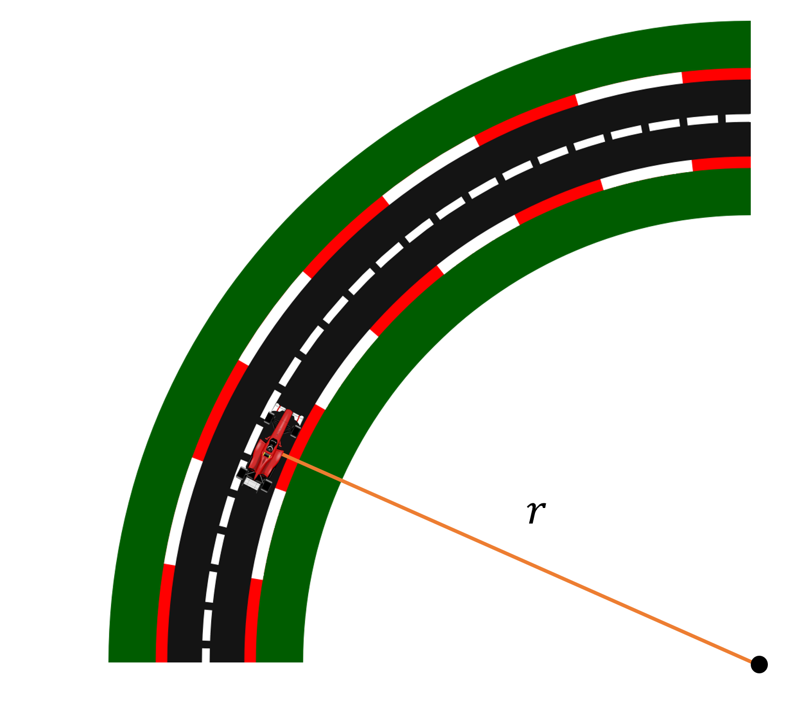

# {{ params_vars_title }}

A circular racetrack has a radius of $r = {{ params_r }} \ \rm{m}$.
A race car races at a speed of $v = {{ params_va }} \ \rm{m/s}$.
For a short distance starting at $s = 0 \ \rm{m}$, the race car increases its velocity at $\dot v = {{ params_vad }}.s \ \rm{m/s^2}$.\
What is the speed and magnitude of its acceleration when it has moved $s = {{ params_s }} \ \rm{m}$

## Part 1

### Answer Section

Please enter in a numeric value in $m/s$.

## Part 2

### Answer Section

Please enter in a numeric value in $m/s^2$.

## Attribution

Problem is licensed under the [CC-BY-NC-SA 4.0 license](https://creativecommons.org/licenses/by-nc-sa/4.0/).  