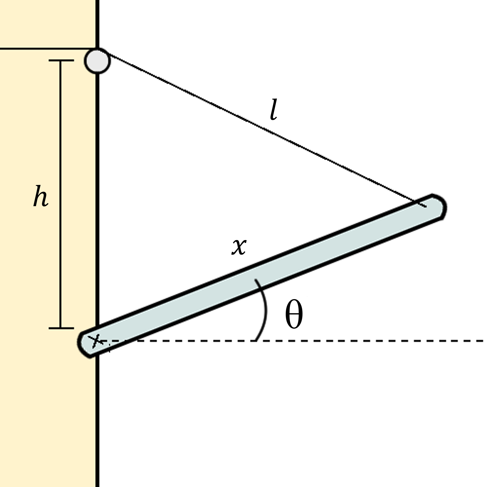

# {{ params_vars_title }}
A platform of length $x = {{params_x}}\ \rm{m}$ is being folded up against a wall by a rope pulling on its end.
The rope is retracting at a constant rate of $\dot{\ell} = {{params.l_dot}}\ \rm{m/s}$.
The distance between the pivot and where the rope is pulling from is $h = {{params_h}}\ \rm{m}$.

## Part 1

When $\theta = {{params_theta}}^{\circ}$, what is $\dot{\theta}$?

### Answer Section

Please enter in a numeric value in $/s$.

## Part 2

What is $\ddot{\theta}$?

### Answer Section

Please enter in a numeric value in $/s^2$.

## Attribution

Problem is licensed under the [CC-BY-NC-SA 4.0 license](https://creativecommons.org/licenses/by-nc-sa/4.0/).  