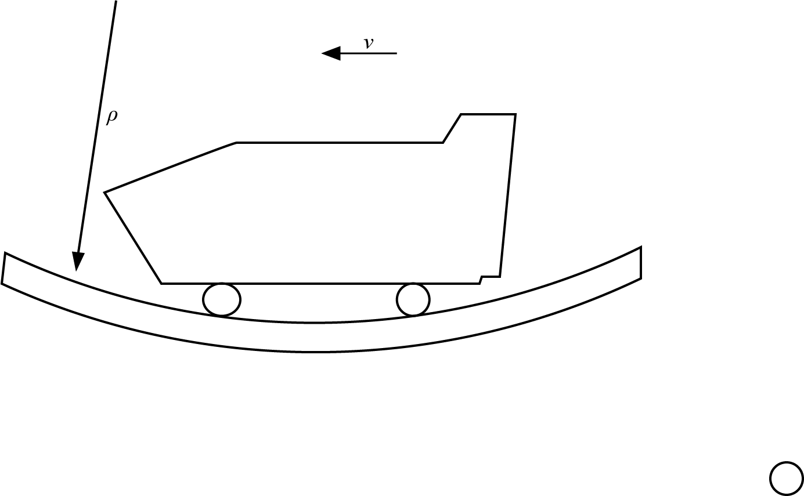

# {{ params.vars.title }}
As a rollercoaster passes the bottommost point in a loop, an accelerometer records an acceleration of ${{params.a}}g$.
The speed of the car is ${{params.speed_of_car}}km/h$ and is decreasing at a rate of ${{params.rate_of_decrease}}km/h$ every second.

## Question Text

Determine the radius of curvature at the position shown.

### Answer Section

Please enter in a numeric value in {{ params.vars.units }}.

## Attribution

Problem is licensed under the [CC-BY-NC-SA 4.0 license](https://creativecommons.org/licenses/by-nc-sa/4.0/).  