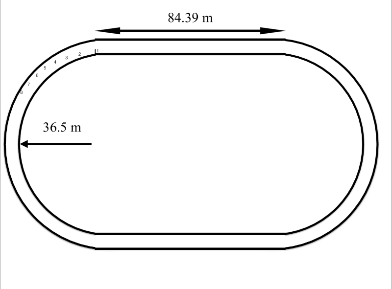

# {{ params_vars_title }}
In the 200 m dash, runners start on a semi-circular part of the track and finish on a straight. The straight has a length of 84.39 m, the radius of the inside of the lane 1 track is 36.5 m, and the lanes are 1.22 m in width.

## Part 1

If a runner runs 30 cm from the inside edge of lane 1, find the distance travelled around the half circle.

### Answer Section

Please enter in a numeric value in m.

## Part 2

If a runner runs 30 cm from the inside edge of lane 1, find the total distance travelled in the race.

### Answer Section

Please enter in a numeric value in m.

## Part 3

What total distance does a runner running 20 cm from the inside edge of lane 8 travel if their start is staggered 26.516 m further around the semi-circle than the lane 1 runner?

### Answer Section

Please enter in a numeric value in m.

## Part 4

If each runner has a tangential acceleration of 2.3 m/$s^{2}$ for the first 5.1 s, before running at a constant speed, what is the speed of each runner at the 5.0 s mark?

### Answer Section

Please enter in a numeric value in m/s.

## Part 5

At 5.0 s, what is the magnitude of the lane 1 runners total acceleration?

### Answer Section

Please enter in a numeric value in m/$s^{2}$.

## Part 6

At 5.0 s, what is the magnitude of the lane 8 runners total acceleration?

### Answer Section

Please enter in a numeric value in m/$s^{2}$.

## Part 7

If both runners have the same mass, which runner will have to push harder to attain and maintain their speed through the corner?

### Answer Section

Answer in 2-3 sentences, try and use full sentences.

## Part 8

Why do you think runners are not started on the straights in the 200 m dash?

### Answer Section

Answer in 2-3 sentences, try and use full sentences.

## Attribution

Problem is licensed under the [CC-BY-NC-SA 4.0 license](https://creativecommons.org/licenses/by-nc-sa/4.0/).  