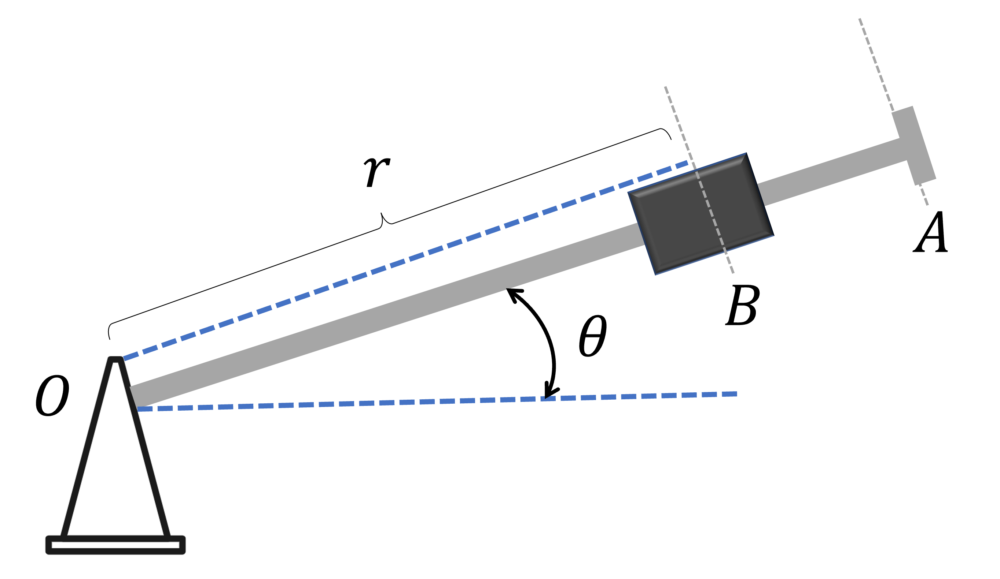

# {{ params_vars_title }}
The rotation of the arm $OA$ rotates about $O$ such that $\theta={{params_n1}}t^2$, where $\theta$ is in radians and $t$ in seconds.
Collar $B$ slides along the arm such that its distance to $O$ is $r={{params_n2}} - {{params_n3}}t^2$, where $r$ is in meters, and $t$ in seconds.

## Part 1

After the arm $OA$ has rotated through ${{params_theta}}^\circ$, what is the magnitude of the relative acceleration of the collar $B$ with respect to the arm?

### Answer Section

Please enter in a numeric value in $m/s^2$.

## Part 2

What is the total relative speed of collar $B$ with respect to the arm?

### Answer Section

Please enter in a numeric value in $m/s$.

## Attribution

Problem is licensed under the [CC-BY-NC-SA 4.0 license](https://creativecommons.org/licenses/by-nc-sa/4.0/).  