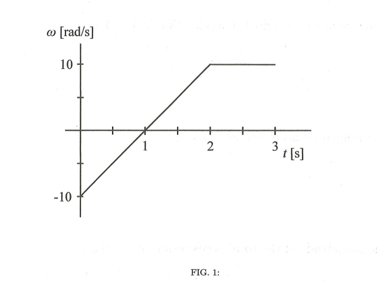

# {{ params.vars.title }}
 

The angular velocity of an object in circular motion at a distance $r =$ {{params.r}} $\rm{m}$ from the point of rotation is shown in Fig. 1.

## Part 1

Choose the option which correctly states at which times the object is speeding up and the sign of its angular acceleration during this period.

### Answer Section

- {{ params.part1.ans1.value }}
- {{ params.part1.ans2.value }}
- {{ params.part1.ans3.value }}
- {{ params.part1.ans4.value }}
- {{ params.part1.ans5.value }}

## Part 2

Choose the option which correctly states at which times the object is slowing down and the sign of its angular acceleration during this period.

### Answer Section

- {{ params.part2.ans1.value }}
- {{ params.part2.ans2.value }}
- {{ params.part2.ans3.value }}
- {{ params.part2.ans4.value }}
- {{ params.part2.ans5.value }}

## Part 3

Find the speed of the object at $t = 2 \rm{s}$.

### Answer Section

Please enter in a numeric value.

## Part 4

Find the magnitude of the centripetal acceleration at $t = $ {{params.t}} $\rm{s}$.

### Answer Section

Please enter in a numeric value.

## Part 5

Find the tangential acceleration at $t = $ {{params.t}} $\rm{s}$.

### Answer Section

Please enter in a numeric value.

## Part 6

Find the magnitude of the total acceleration at $t = $ {{params.t}} $\rm{s}$.

### Answer Section

Please enter in a numeric value.

## Part 7

At $t = 1 \rm{s}$, what is the direction of the acceleration?

### Answer Section

- {{ params.part7.ans1.value }}
- {{ params.part7.ans2.value }}
- {{ params.part7.ans3.value }}

## Part 8

At $t = 2.5 \rm{s}$, what is the direction of the acceleration?

### Answer Section

- {{ params.part8.ans1.value }}
- {{ params.part8.ans2.value }}
- {{ params.part8.ans3.value }}

## Part 9

What is the angular displacement from $t = 0 \rm{s}$, to $t = 1 \rm{s}$?

### Answer Section

Please enter in a numeric value.

## Attribution

Problem is licensed under the [CC-BY-NC-SA 4.0 license](https://creativecommons.org/licenses/by-nc-sa/4.0/).  