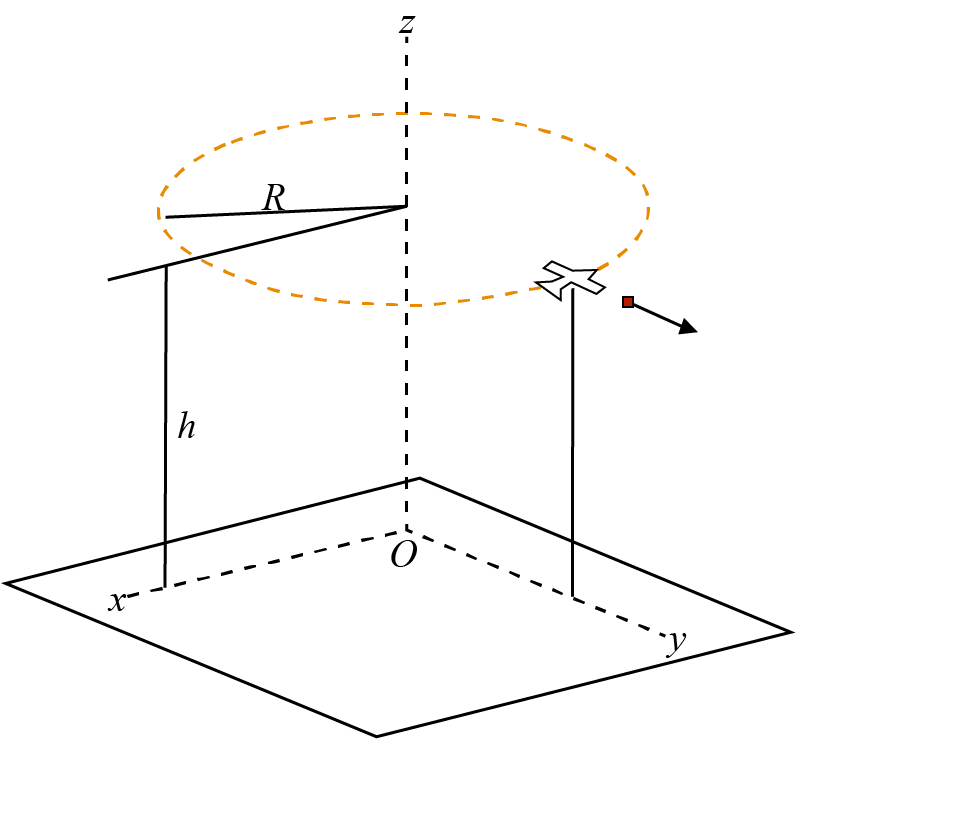

# {{ params.vars.title }}
${{params.z0}}ft$ above the ground, a cargo plane flies in a horizontal circle with radius of ${{paramsy.y0}}ft$.
Its speed is constant at ${{params.vx0}}ft/s$.
At the moment shown, a small package is ejected from the right side of the plane with a horizontal velocity of ${{params.vx0}}ft/s$ relative to the cargo plane.
Calculate the coordinates of the point of impact, neglect air resistance.

## Part 1

Calculate the X - coordinate of the landing point.

### Answer Section

## Part 2

Calculate the Y - coordinate of the landing point.

### Answer Section

## Part 3

Calculate the Z - coordinate of the landing point.

### Answer Section

## Attribution

Problem is licensed under the [CC-BY-NC-SA 4.0 license](https://creativecommons.org/licenses/by-nc-sa/4.0/).  