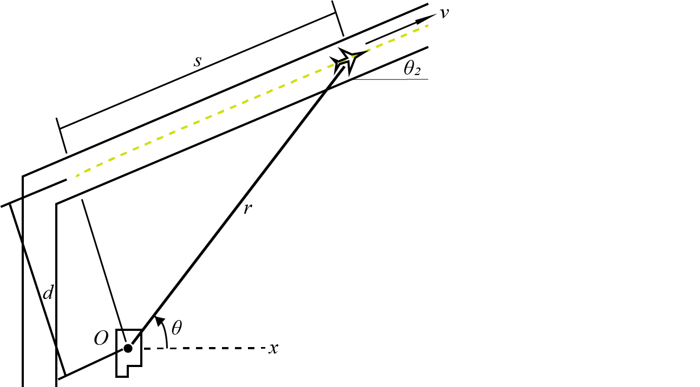

# {{ params.vars.title }}

A radar located at O is part of a traffic control system for an airport, located $d = {{params.d}}ft$ from the main runway.
At a certain moment during takeoff, the radar indicates an angle $\theta\_{1} = {{params.angle1}}^{\circ}$ and the range rate $\dot r = {{params.r_dot}}ft/sec$.
The angle $\theta\_{2} = {{params.angle2}}^{\circ}$

## Part 1

Determine the corresponding speed $v$ of the aircraft.

### Answer Section

Please enter in a numeric value in $ft/s$.

## Part 2

Determine the value of $\dot \theta$.

### Answer Section

Please enter in a numeric value in $rad/s$.

## Attribution

Problem is licensed under the [CC-BY-NC-SA 4.0 license](https://creativecommons.org/licenses/by-nc-sa/4.0/).  