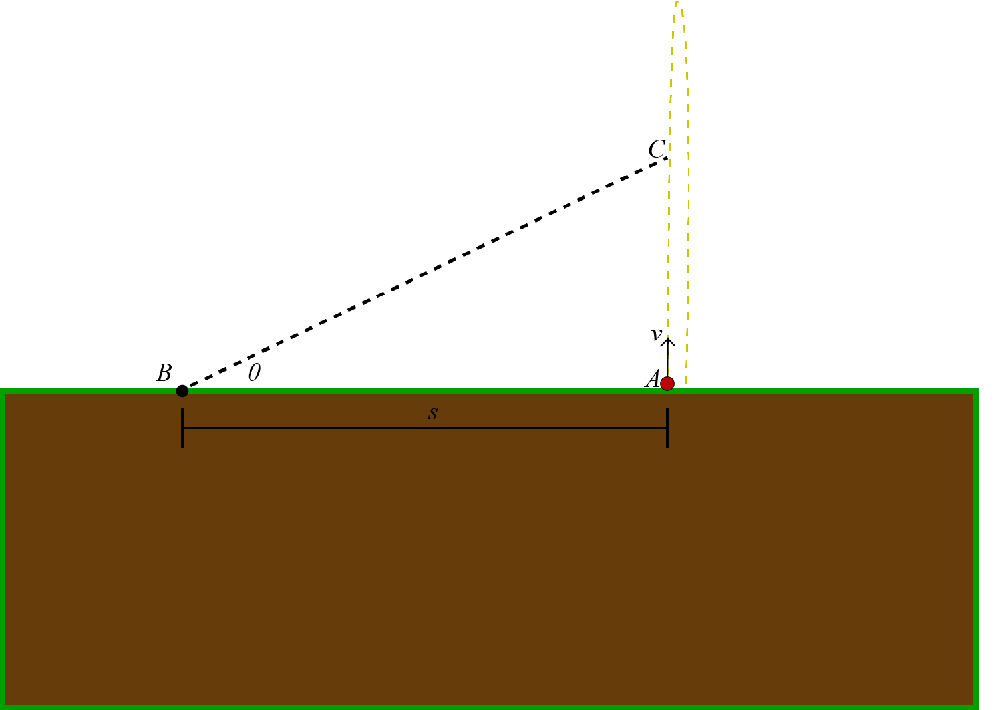

# {{ params.vars.title }}
A ball is launched vertically at Point A with an initial speed of $v = {{params.v0}} m/s$.
It passes through the Point C twice, once on the way up ($t_1$), and again on the way down ($t_2$).
Ignoring air resistance and drag, answer the following questions **relative to an observer standing** {{params.distance}} $m$ away, at Point B.

## Part 1

At what time $t_1$ will the line of sight make a $\theta$ = 45 $^{\circ}$ angle with the horizontal?

*Hint: The line of sight is the dotted line connecting Point B to Point C.*

### Answer Section

Please enter in a numeric value in $seconds$.

## Part 2

Compute the velocity of the ball at $t_1$ (Positive if up, negative if down).

### Answer Section

Please enter in a numeric value in $m/s$.

## Part 3

At what time $t_2 s$ will the line of sight make a $\theta$ = 45 $^{\circ}$ angle with the horizontal?

*Hint: The line of sight is the dotted line connecting Point B to Point C.*

### Answer Section

- Please enter in a numeric value in $seconds$.

## Part 4

Compute the velocity of the ball at $t_2$ (Positive if up, negative if down).

### Answer Section

Please enter in a numeric value in $m/s$.

## Attribution

Problem is licensed under the [CC-BY-NC-SA 4.0 license](https://creativecommons.org/licenses/by-nc-sa/4.0/).  