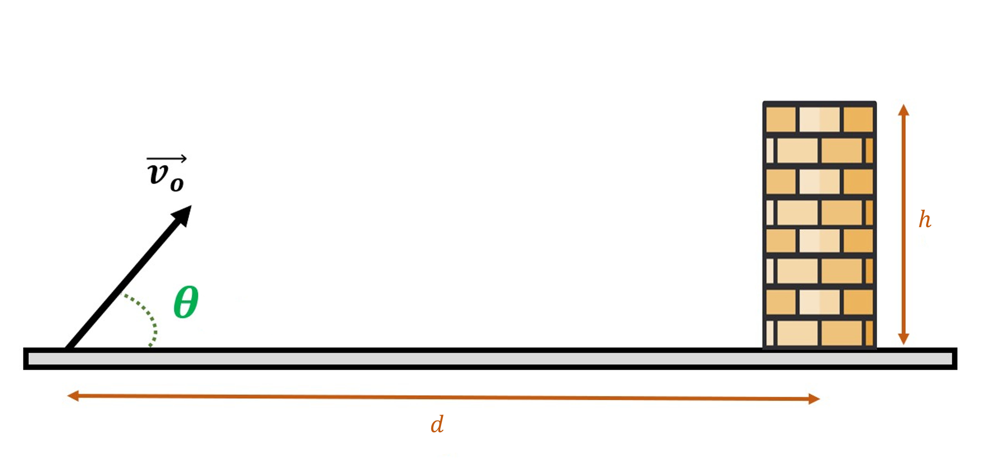

# {{ params_vars_title }}
A person {{params_phrases_action}} a {{params_phrases_ball}} towards their friend who is behind a ${{params_h}} \ \rm{m}$ {{params_phrases_obstacle}}. The {{params_phrases_ball}} has an initial velocity of ${{params_v}} \ \rm{m/s}$ at an angle ${{params_theta}}^\circ$ relative to ground.

## Part 1

If the {{params_phrases_obstacle}} is ${{params_d}} \ \rm{m}$ away, how far does the {{params_phrases_ball}} go?

### Answer Section

- {{ params_part1_ans1_value }}
- {{ params_part1_ans2_value }}
- {{ params_part1_ans3_value }}

## Attribution

Problem is licensed under the [CC-BY-NC-SA 4.0 license](https://creativecommons.org/licenses/by-nc-sa/4.0/).  