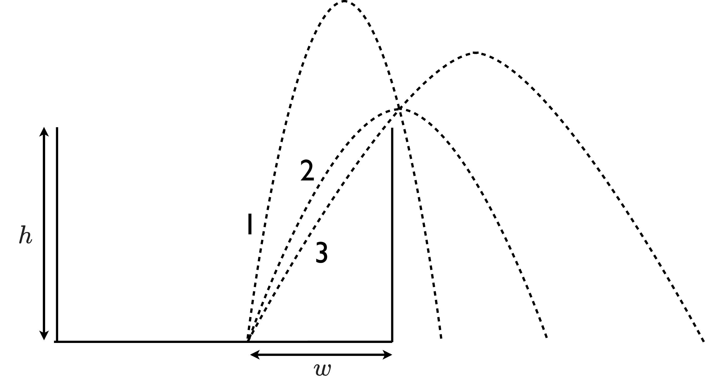

# {{ params.vars.title }}
A cat jumps out of a laundry basket, travelling $w = $ {{ params.w }} $cm$ horizontally before just clearing the $h =$ {{ params.h }} $cm$ high edge of the basket.
The parabolic trajectories of three different jumps labelled 1, 2, and 3 are shown below.

<h5>Long Description of image: The parabolic trajectories of three different jumps.</h5>
Trajectory 1 has the highest peak and smallest range.  
Trajectory 2 has the lowest peak and the second largest range.  
Trajectory 3 has the second highest peak and the largest range.  

Long description ends.

## Part 1

Rank the time in the air ($\Delta t_1, \Delta t_2, and \Delta t_3$, respectively) of the cat on each path.

### Answer Section

- {{ params.part1.ans1.value }}
- {{ params.part1.ans2.value }}
- {{ params.part1.ans3.value }}
- {{ params.part1.ans4.value }}
- {{ params.part1.ans5.value }}
- {{ params.part1.ans6.value }}

## Part 2

Rank the relative sizes of the $x-$components of the velocity vectors for path 1 ($v\_{x1}$) and path 2 ($v\_{x2}$).

### Answer Section

- {{ params.part2.ans1.value }}
- {{ params.part2.ans2.value }}
- {{ params.part2.ans3.value }}
- {{ params.part2.ans4.value }}
- {{ params.part2.ans5.value }}
- {{ params.part2.ans6.value }}

## Attribution

Problem is licensed under the [CC-BY-NC-SA 4.0 license](https://creativecommons.org/licenses/by-nc-sa/4.0/).  