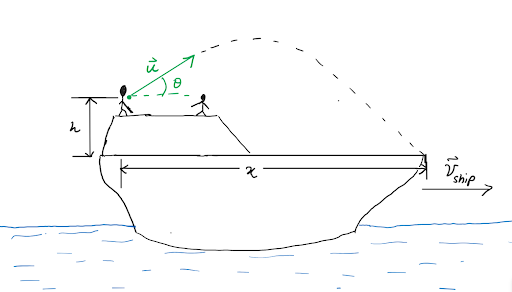

# {{ params_vars_title }}

A group of students are playing a game of cricket atop a ship moving at $v = {{ params_v }} \ \rm{m/s}$.
The cricket ball is thrown with velocity $u = {{ params_u }} \ \rm{m/s}$, from an elevated point on the ship, $h = {{ params_h }} \ \rm{m}$ up.

## Part 1

What is the initial projection angle($\theta$) relative to the horizontal of the ball if it travels the entire length of the moving ship, which is $x = {{ params_x }} \rm{m}$ long?

### Answer Section

Please enter in a numeric value in {{ params_vars_units }}.

## Part 2

What is the absolute projection speed of the ball?

### Answer Section

Please enter in a numeric value in {{ params_vars_units }}.

## Attribution

Problem is licensed under the [CC-BY-NC-SA 4.0 license](https://creativecommons.org/licenses/by-nc-sa/4.0/).  