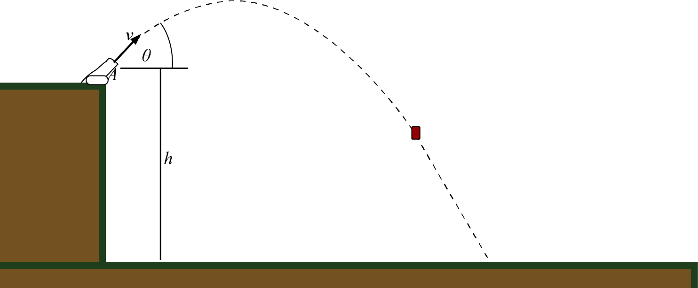

# {{ params_vars_title }}
A cannon fires a projectile at a {{params_angle}}$^{\circ}$ angle at {{params.speed_of_jett}} $km/h$. The cannon is {{params.distance_from_ground}} $m$ above the ground.

## Part 1

Calculate the time taken $t$ from the point of fire to the point at which the projectile strikes the ground.

### Answer Section

Please enter in a numeric value in {{ params.vars.time_units }}.

## Part 2

Calculate the displacement in the $x$ direction from the point of fire to the point at which the projectile strikes the ground.

### Answer Section

- {{ params.part2.ans1.value}} {{ params.vars.distance_units}}.

## Attribution

Problem is licensed under the [CC-BY-NC-SA 4.0 license](https://creativecommons.org/licenses/by-nc-sa/4.0/).  