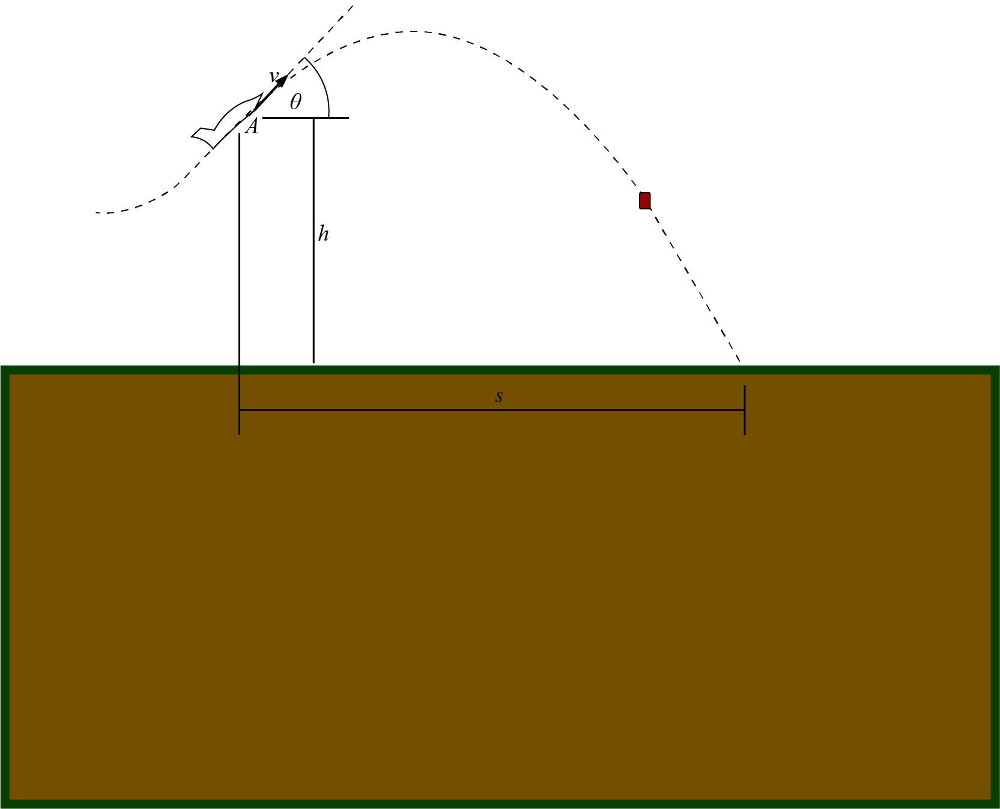

# {{ params.vars.title }}
The pilot of a jet pulls into a steep {{params.angle}}$^{\circ}$ climb at {{params.speed_of_jett}} $km/h$ and releases a crate at point A, {{params.distance_from_ground}} $m$ above the ground.

## Part 1

Calculate the time taken $t$ from the point of release to the point at which the package strikes the ground.

### Answer Section

Please enter in a numeric value in {{ params.vars.time_units }}.

## Part 2

Calculate the distance $s$ from the point of release to the point at which the package strikes the ground.

### Answer Section

- {{ params.part2.ans1.value}} {{ params.vars.distance_units}}.

## Attribution

Problem is licensed under the [CC-BY-NC-SA 4.0 license](https://creativecommons.org/licenses/by-nc-sa/4.0/).  