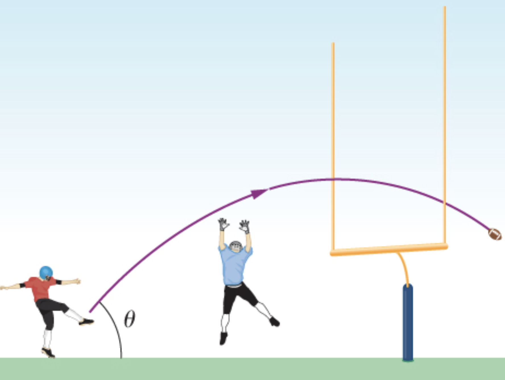

# {{ params_vars_title }}
When a field goal kicker kicks a football at ${{ params_theta }}^\circ$ to the horizontal, the ball clears the crossbar of the goalposts by ${{ params_deltahg }}$ $\rm{m}$.
The crossbar of the goalpoasts is ${{ params_hg }}$ $\rm{m}$ above the field and ${{ params_dg }}$ $\rm{m}$ away from the kicker.

## Part 1

Calculate the time it takes for the ball's horizontal position to be in line with the crossbar of the goalposts.

### Answer Section

Please enter an answer in $\rm{s}$.

## Part 2

What initial speed $v_i$ does the kicker impart to the football?

### Answer Section

Please enter an answer in $\rm{m/s}$.

## Part 3

In addition to clearing the crossbar, the football must be high enough in the air early during its flight to clear the reach of the onrushing defensive lineman.
If the lineman is ${{ params_dl1 }}$ $\rm{m}$ away and has a vertical reach of ${{ params_hl }}$ $\rm{m}$, at what height does the football pass the linesman relative to their reach $\Delta h$?
Hint: A negative answer indicates that the field goal attempt would be blocked.

### Answer Section

Please enter an answer in $\rm{m}$.

## Part 4

What if the lineman is ${{ params_dl2 }}$ $\rm{m}$ away and had the same vertical reach of ${{ params_hl }}$ $\rm{m}$ - at what height does the football pass the linesman relative to their reach $\Delta h$?

### Answer Section

Please enter an answer in $\rm{m}$.

## Attribution

Problem is from the [OpenStax University Physics Volume 1](https://openstax.org/details/books/university-physics-volume-1) textbook, licensed under the [CC-BY 4.0 license](https://creativecommons.org/licenses/by/4.0/). 