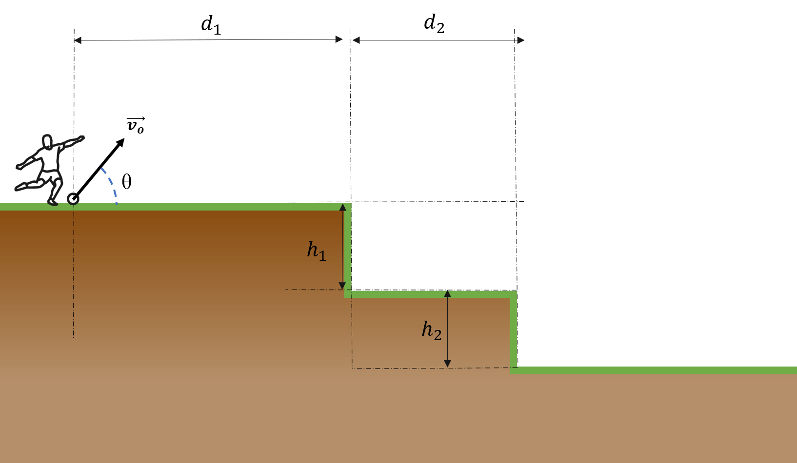

# {{ params_vars_title }}

A football player is practicing some of their lob passes at the training academy. They strike the ball giving it a velocity of $v = {{params_v}} \ \rm{m/s}$ at an angle $\theta  = {{params_theta}}^{\circ}$. The training field has a special geometry governed by these paramaters: $h_1 = {{params_h1}} \ \rm{m} $, $h_2 = {{params_h2}} \ \rm{m} $, $d_1 = {{params_d1}} \ \rm{m} $, and $d_2 = {{params_d2}} \ \rm{m} $.
 
Find the location where the ball first lands.

## Part 1

What is the x location of where the ball first lands?

### Answer Section

Please enter in a numeric value in $\rm{m}$.

## Part 2

What is the y location of where the ball first lands?

### Answer Section

Please enter in a numeric value in $\rm{m}$.

## Attribution

Problem is licensed under the [CC-BY-NC-SA 4.0 license](https://creativecommons.org/licenses/by-nc-sa/4.0/).  