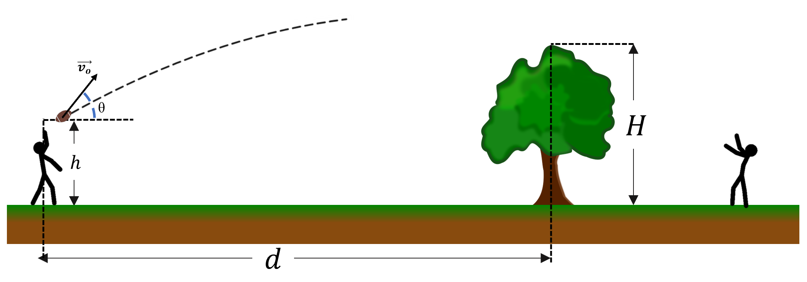

# {{ params_vars_title }}

If a person throws a football towards their friend who is behind a tree, will the football hit or clear the tree?
The football is thrown from a distance $d = {{ params_d }} \ \rm{m}$ from the tree, the tree has a height of $H = {{ params_h }} \ \rm{m}$, and the football is released at a height of $h = {{ params_h2 }} \ \rm{m}$.
The velocity of the football is $v_0 = {{ params_v }} \ \rm{m/s}$ and the angle that the football is thrown relative to the ground is $\theta = {{ params_theta }}^{\circ}$.

## Part 1

### Answer Section

- {{ params_part1_ans1_value }}
- {{ params_part1_ans2_value }}

## Attribution

Problem is licensed under the [CC-BY-NC-SA 4.0 license](https://creativecommons.org/licenses/by-nc-sa/4.0/).  