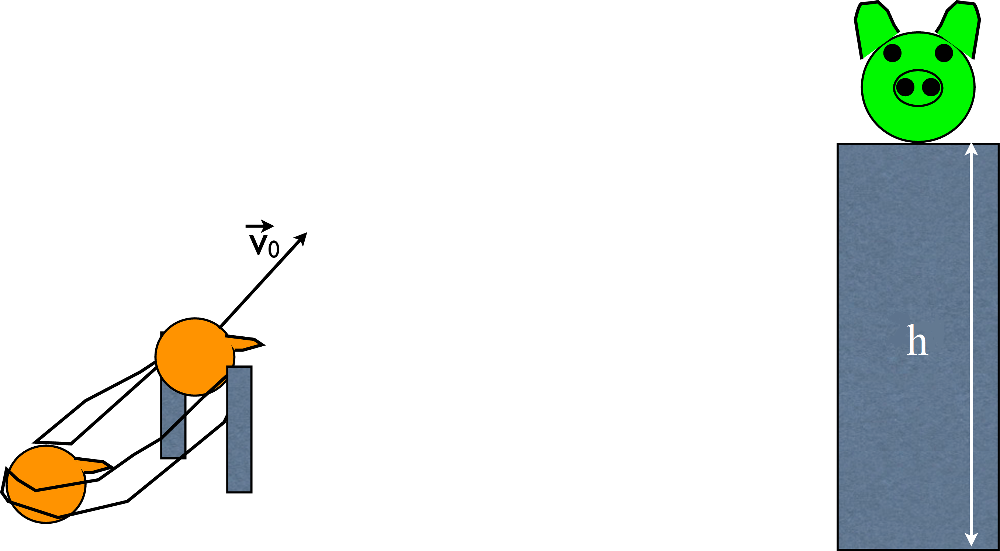

# {{ params.vars.title }}
At a local pumpkin patch, {{ params.vars.name }} is hired to create a Hallowe'en gourd launcher.  {{ params.vars.name }} wants to launch a {{ params.m_gourd }} $kg$ gourd (decorated as an "Angry Bird") at a large pumpkin (decorated as a "pig") which sits on top of a $h=$ {{ params.h }} $m$ tall hay bale as shown in the figure.

Assume that the gourd undergoes projectile motion and that it hits the pumpkin ("pig") with a velocity of $\overrightarrow{v} =$ {{ params.v_f }} $\frac{\text{m}}{\text{s}} \hat{x}$.

(You may neglect the initial height of the projectile launcher to find the time the gourd takes to reach the pumpkin.)

## Part 1

What was the $x$-component of the gourd's initial velocity?

### Answer Section

Please enter in a numeric value in $m/s$.

## Part 2

What was the $y$-component of the gourd's initial velocity?

### Answer Section

Please enter in a numeric value in $m/s$.

## Part 3

What horizontal distance away from the pumpkin was the gourd launched from?

### Answer Section

Please enter in a numeric value in $m$.

## Part 4

What was the magnitude of the initial velocity of the gourd?

### Answer Section

Please enter in a numeric value in $m/s$.

## Part 5

What was the angle above the horizontal at which the gourd was launched?

### Answer Section

Please enter in a numeric value in degrees.

## Attribution

Problem is licensed under the [CC-BY-NC-SA 4.0 license](https://creativecommons.org/licenses/by-nc-sa/4.0/).  